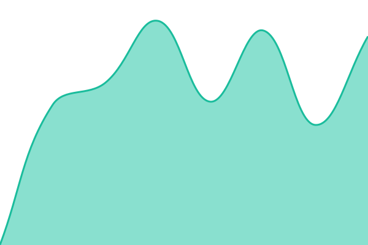
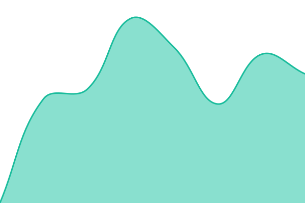
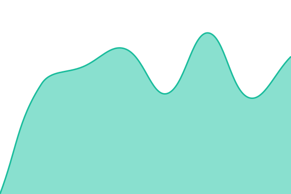
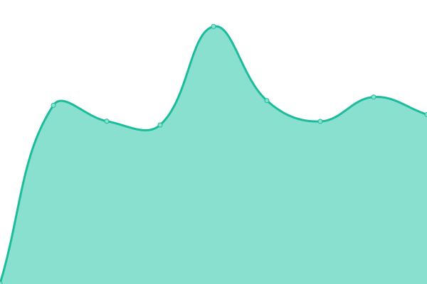

# [📈 Live Status](https://derfreitag.github.io/freitagde-upptime/): <!--live status--> **🟧 Partial outage**

This repository contains the open-source uptime monitor and status page for [Der Freitag](https://derfreitag.github.io/freitagde-upptime/), powered by [Upptime](https://github.com/upptime/upptime).

With [Upptime](https://upptime.js.org), you can get your own unlimited and free uptime monitor and status page, powered entirely by a GitHub repository. We use [Issues](https://github.com/derFreitag/freitagde-upptime/issues) as incident reports, [Actions](https://github.com/derFreitag/freitagde-upptime/actions) as uptime monitors, and [Pages](http://derfreitag.github.io/freitagde-upptime/) for the status page.

<!--start: status pages-->
<!-- This summary is generated by Upptime (https://github.com/upptime/upptime) -->
<!-- Do not edit this manually, your changes will be overwritten -->
<!-- prettier-ignore -->
| URL | Status | History | Response Time | Uptime |
| --- | ------ | ------- | ------------- | ------ |
|  [Freitag.de](https://www.freitag.de) | 🟩 Up | [freitag-de.yml](https://github.com/derFreitag/freitagde-upptime/commits/HEAD/history/freitag-de.yml) | 

 1366ms
     
 | 

<a href="https://derfreitag.github.io/freitagde-upptime/history/freitag-de">100.00%</a>
    

|  [Herald](https://www.freitag.de/@@herald-health-check) | 🟩 Up | [herald.yml](https://github.com/derFreitag/freitagde-upptime/commits/HEAD/history/herald.yml) | 

 422ms
     
 | 

<a href="https://derfreitag.github.io/freitagde-upptime/history/herald">100.00%</a>
    

|  [Abo Freitag](https://abo.freitag.de/) | 🟩 Up | [abo-freitag.yml](https://github.com/derFreitag/freitagde-upptime/commits/HEAD/history/abo-freitag.yml) | 

 1060ms
     
 | 

<a href="https://derfreitag.github.io/freitagde-upptime/history/abo-freitag">100.00%</a>
    

|  [Verlag Freitag](https://verlag.freitag.de/) | 🟩 Up | [verlag-freitag.yml](https://github.com/derFreitag/freitagde-upptime/commits/HEAD/history/verlag-freitag.yml) | 

 1018ms
     
 | 

<a href="https://derfreitag.github.io/freitagde-upptime/history/verlag-freitag">100.00%</a>
    

|  [digital.freitag.de](https://digital.freitag.de/admin/) | 🟩 Up | [digital-freitag-de.yml](https://github.com/derFreitag/freitagde-upptime/commits/HEAD/history/digital-freitag-de.yml) | 

 1059ms
     
 | 

<a href="https://derfreitag.github.io/freitagde-upptime/history/digital-freitag-de">100.00%</a>
    

|  [Storybook Freitag](https://storybook.freitag-verlag.de/) | 🟩 Up | [storybook-freitag.yml](https://github.com/derFreitag/freitagde-upptime/commits/HEAD/history/storybook-freitag.yml) | 

 835ms
     
 | 

<a href="https://derfreitag.github.io/freitagde-upptime/history/storybook-freitag">100.00%</a>
    

|  [Mein Freitag](https://mein.freitag.de/) | 🟩 Up | [mein-freitag.yml](https://github.com/derFreitag/freitagde-upptime/commits/HEAD/history/mein-freitag.yml) | 

 1638ms
     
 | 

<a href="https://derfreitag.github.io/freitagde-upptime/history/mein-freitag">100.00%</a>
    

|  [Sentry](https://sentry.dfstats.fcio.net/) | 🟩 Up | [sentry.yml](https://github.com/derFreitag/freitagde-upptime/commits/HEAD/history/sentry.yml) | 

 1342ms
     
 | 

<a href="https://derfreitag.github.io/freitagde-upptime/history/sentry">89.24%</a>
    

|  [Grafana](https://grafana.dfstats.fcio.net/) | 🟥 Down | [grafana.yml](https://github.com/derFreitag/freitagde-upptime/commits/HEAD/history/grafana.yml) | 

 0ms
     
 | 

<a href="https://derfreitag.github.io/freitagde-upptime/history/grafana">0.00%</a>
    

|  [Upscore JS](https://stone.freitag.de/files/site_script/freitag.de.js) | 🟩 Up | [upscore-js.yml](https://github.com/derFreitag/freitagde-upptime/commits/HEAD/history/upscore-js.yml) | 

 415ms
     
 | 

<a href="https://derfreitag.github.io/freitagde-upptime/history/upscore-js">100.00%</a>
    

<!--end: status pages-->

[**Visit our status website →**](https://derfreitag.github.io/freitagde-upptime)

## 📄 License

- Powered by: [Upptime](https://github.com/upptime/upptime)
- Code: [MIT](./LICENSE) © [Anand Chowdhary](https://anandchowdhary.com), supported by [Pabio](https://pabio.com)
- Data in the `./history` directory: [Open Database License](https://opendatacommons.org/licenses/odbl/1-0/)
